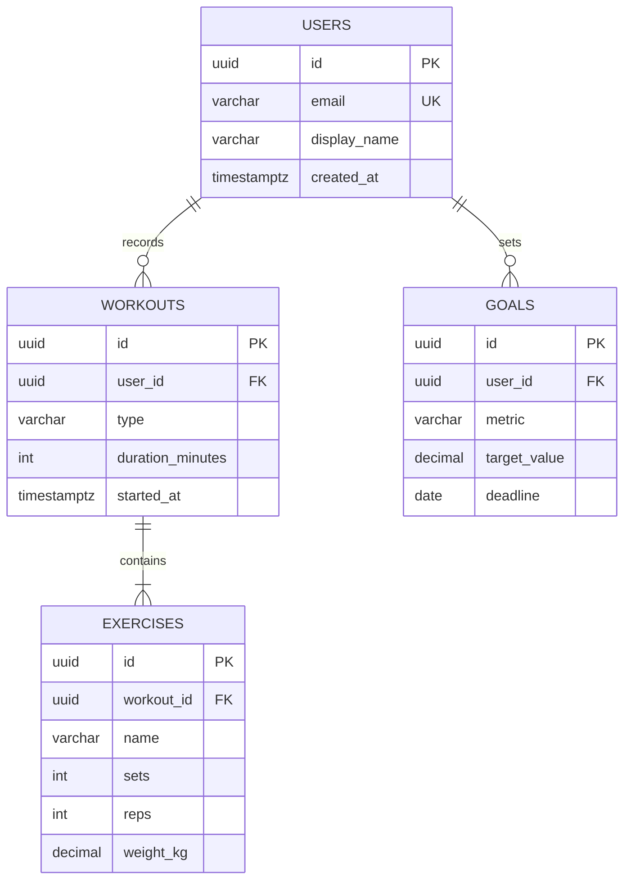

# Database Design Skill

## PostgreSQL Migration Template (Flyway)
File naming: `V{number}__{description}.sql` (double underscore)

```sql
-- V1__initial_schema.sql

-- Enable UUID extension
CREATE EXTENSION IF NOT EXISTS "pgcrypto";

CREATE TABLE users (
    id          UUID PRIMARY KEY DEFAULT gen_random_uuid(),
    email       VARCHAR(255) NOT NULL UNIQUE,
    first_name  VARCHAR(100) NOT NULL,
    last_name   VARCHAR(100) NOT NULL,
    role        VARCHAR(50)  NOT NULL DEFAULT 'USER',
    is_active   BOOLEAN      NOT NULL DEFAULT TRUE,
    created_at  TIMESTAMPTZ  NOT NULL DEFAULT NOW(),
    updated_at  TIMESTAMPTZ  NOT NULL DEFAULT NOW(),
    deleted_at  TIMESTAMPTZ  NULL
);

-- Always index foreign keys and lookup columns
CREATE INDEX idx_users_email ON users(email);
CREATE INDEX idx_users_active ON users(is_active) WHERE is_active = TRUE;

-- Auto-update updated_at trigger
CREATE OR REPLACE FUNCTION update_updated_at()
RETURNS TRIGGER AS $$
BEGIN
    NEW.updated_at = NOW();
    RETURN NEW;
END;
$$ LANGUAGE plpgsql;

CREATE TRIGGER trg_users_updated_at
    BEFORE UPDATE ON users
    FOR EACH ROW EXECUTE FUNCTION update_updated_at();
```

## Firestore Collection Design Template
```
# Firestore Structure — Fitness App Example

users/
  {userId}/
    - email: string
    - displayName: string
    - photoUrl: string
    - createdAt: timestamp
    - stats:                    # Embedded object (read together)
        totalWorkouts: number
        totalMinutes: number

    workouts/                   # Subcollection
      {workoutId}/
        - type: string          # "running", "weights", "yoga"
        - durationMinutes: number
        - caloriesBurned: number
        - startedAt: timestamp
        - completedAt: timestamp
        - exercises: [          # Array of embedded objects
            { name: "Bench Press", sets: 3, reps: 10, weight: 135 }
          ]

# Firestore Security Rules Skeleton
rules_version = '2';
service cloud.firestore {
  match /databases/{database}/documents {
    match /users/{userId} {
      allow read, write: if request.auth != null && request.auth.uid == userId;
      match /workouts/{workoutId} {
        allow read, write: if request.auth != null && request.auth.uid == userId;
      }
    }
  }
}
```

## Common Index Strategies
```sql
-- B-tree (default) — equality and range queries
CREATE INDEX idx_orders_user_id ON orders(user_id);

-- Composite — multi-column WHERE clauses
CREATE INDEX idx_orders_user_status ON orders(user_id, status);

-- Partial — only index rows matching a condition
CREATE INDEX idx_orders_pending ON orders(created_at)
    WHERE status = 'PENDING';

-- GIN — full-text search or JSONB containment
CREATE INDEX idx_products_tags ON products USING GIN(tags);
```

## ERD Template (Mermaid)

